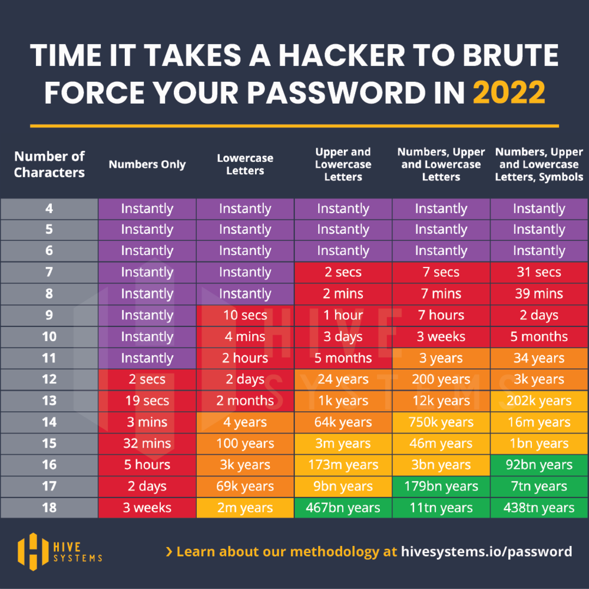

# h4_Hash
## Applied Cryptography

### 2.3 One-Way Functions

- The **one-way function** is the central element to the understanding and operation of public-key cryptography.
- The **one-way** function works as follows. We take an element x and convert it into a function (f(x)). 
- It can be used to encrypt passwords, files, folders, messages, etc.
- It is a simple function to set up, but it is very complicated to solve. Because as seen in the previous point, it is simple to transform an element x into f(x), but it is more complicated to solve f(x) to find x without any information.
- It can take millions of years to solve x starting from f(x).
- Public key cryptography has another element in its setup. A secret information that allows the function to be solved provided it is known, in other words **a backdoor**.

### 2.4 One-Way Hash Functions

- Compression function, contraction function, message digest, figerprint, etc., are the names for the **one-way hash function**.
- It is inseparable from modern crypthography methods
- A hash function will ask for an input string of variable length, which is also called a **pre-image**. Then it will convert it into a fixed length string, which is called the **hash value**.
- The hash of a pre-image can also be used to ensure the authenticity of a copy of the original pre-image. To do this, the user will only have to compare the two hashes. If there is a difference it means that the copy may have been modified. So it would be potentially less secure.
- It is almost impossible to generate the same hash for two different images. 
- Changing a single bit in the original pre-image completely changes the hash.
- **MAC** and **DAC** are one-way hash functions to which the encryption key is added to the pre-image. This way, only the desired person can check the hash value.

MAC : Message Authentication Codes A message authentication code

DAC : data authentication code

### Sources

[ Applied Cryptography, chapter 2 : Protocol Building Blocks](https://learning.oreilly.com/library/view/applied-cryptography-protocols/9781119096726/10_chap02.html#chap02)

-----

## Install Hashcat

To install Hashcat on my virtual machine, I followed the tutorial [Cracking Passwords wit Hashcat](https://terokarvinen.com/2022/cracking-passwords-with-hashcat/) available on the website [terokarvinen.com](https://terokarvinen.com/). 

Before starting any kind of process on your Linux, you should check if your packages are up to date. To do this you can use the following command:

    $ sudo apt-get update
    
If after using the command you see that you need to update your packages, you can use this command: 

    $ sudo apt-get upgrade

Now that your machine is up to date, we can start installing **Hashcat**. To do this you need to run the following command which will allow the installation to proceed:

    $ sudo apt-get -y install hashid hashcat wget
    
Next you will need to create a directory that will contain the hashes you wish to solve and the dictionary(s) you are using.

    $ mkdir hashed
 
You will now go to the new directory named **"hashed"** that you just created. To do this you will use the following command:

    $ cd hashed
    
To be able to start cracking **hash** you need a big dictionary with lots of passwords. For this there is the file **"rockyou.txt"** which can be found on Github and downloaded. You can use the following command to clone the Github repository in the directory you have created:

    $ wget https://github.com/danielmiessler/SecLists/raw/master/Passwords/Leaked-Databases/rockyou.txt.tar.gz
    
Then you have to unzip it with the following command: 

    $ tar xf rockyou.txt.tar.gz

Finally, you can delete the zip or save it. If you want to delete it, you can use the following command: 

    $ rm rockyou.txt.tar.gz

### Source

[Cracking Passwords wit Hashcat](https://terokarvinen.com/2022/cracking-passwords-with-hashcat/)

-----

## Hash Cracking

To crack the hash **8eb8e307a6d649bc7fb51443a06a216f**, I performed the following steps : 

>I went to the **hashed/** directory. 

    $ cd hashed/

>I have created a text file that I have named **h3Hash.txt**. This file will contain the hash I need to crack.

    $ nano h3Hash.txt
    
>I used **hashid** to find the ID number of the different hash types. 

    $ hashid -m 8eb8e307a6d649bc7fb51443a06a216f
    
    or 
    
    $ hashid -m h3Hash.txt
   
>I then started creacking using the **hashcat** tool and the most common hash type **MD5** which is code for **0**. As a dictionary I used the text file **rockyou.txt**. If successful, I told hashcat to save the solution in the text file **"h3Solved.txt"**.

    $ hashcat -m 0 '8eb8e307a6d649bc7fb51443a06a216f' rockyou.txt -o h3Solved.txt
    
>hashcat returned "february". To make sure it was the right answer, I hashed "february" with MD5 and compared the two results. I finally found that "february" was the correct answer.

### Sources

[Cracking Passwords wit Hashcat](https://terokarvinen.com/2022/cracking-passwords-with-hashcat/)

------

## Installation of John the Ripper

To install Jumbo on my virtual machine, I followed the tutorial [Crack File Password With John](https://terokarvinen.com/2023/crack-file-password-with-john/) available on the website [terokarvinen.com](https://terokarvinen.com/). 

Before starting any kind of process on your Linux, you should check if your packages are up to date. To do this you can use the following command:

    $ sudo apt-get update
    
If after using the command you see that you need to update your packages, you can use this command: 

    $ sudo apt-get upgrade
    
The installation of Jombo, the open source version of John the ripper, requires certain prerequisites to enable the installation and use of the software. As explained in the table above from this [tutoriel](https://terokarvinen.com/2023/crack-file-password-with-john/).

To install these pakages, you can do the following command : 

    $ sudo apt-get -y install micro bash-completion git build-essential libssl-dev zlib1g zlib1g-dev zlib-gst libbz2-1.0 libbz2-dev atool zip wget
    
After installing the prerequisites, we need to install the Jumbo version of John the Ripper. To do this you can run the following command, which will allow you to download it. 

    $ git clone --depth=1 https://github.com/openwall/john.git

Then with the **cd** command you will go to the directory that was created when the last command was executed.

    $ cd john/src/
    
When you are in the directory, you can start the compilation with the command below :
 
    $ ./configure
    $ make -s clean && make -sj4
    
Finally, you can launch the application using the following command :

    $ /home/[user]/john/run/john

### Sources

[terokarvinen.com](https://terokarvinen.com/2023/crack-file-password-with-john/)

------

## Zip file password cracking

In this section I will show the steps I took to crack a protected zip file. To start, I went to the tutorial **"Crack File Password With John"** available at [terokarvinen.com](https://terokarvinen.com/2023/crack-file-password-with-john/). Then I downloaded the zip file  **tero.zip** in my **home directory**.

    $ wget https://TeroKarvinen.com/2023/crack-file-password-with-john/tero.zip
    
Being unable to extract the data from the zip because of the password, I started the manipulation to crack the password with the application John the Ripper.

To do this I first extracted the hash from the zip and copied it to a new file.

    $ /home/nicolas/john/run/zip2john tero.zip > tero.zip.hash
    
Then I launched the hash cracking procedure with the following command: 

    $ /home/nicolas/john/run/john tero.zip.hash
    
This command allowed me to instantly crack the password of the zip file. I found the password **butterfly**. The speed of the cracking is explained by the weakness of the password used. It has no capital letters, numbers or special characters, which makes the cracking instantaneous. As shown in the table below.

### Sources

[www.hivesystems.io](https://www.hivesystems.io/blog/are-your-passwords-in-the-green)

[terokarvinen.com](https://terokarvinen.com/2023/crack-file-password-with-john/)

------
